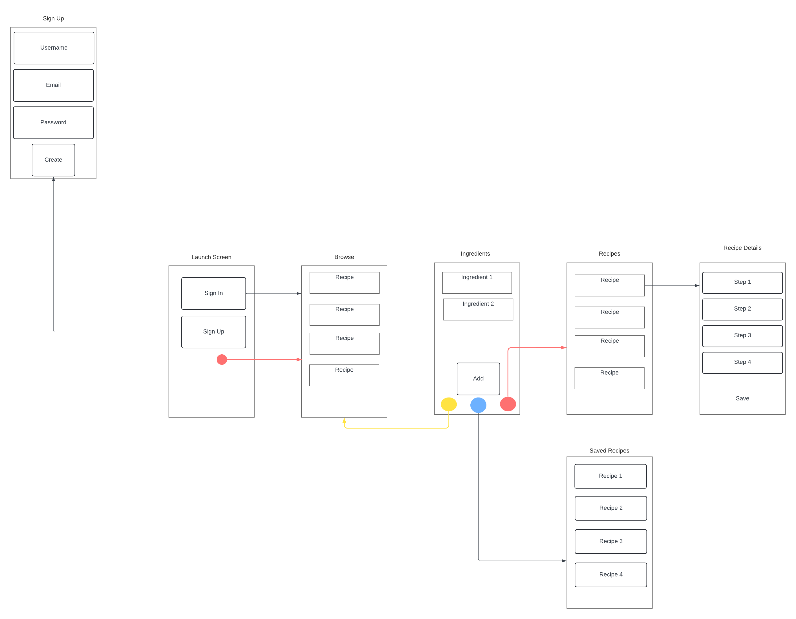

Original App Design Project - KitchenStory README
===

# Kitchen Story

## Table of Contents

1. [Overview](#Overview)
2. [Product Spec](#Product-Spec)
3. [Wireframes](#Wireframes)
4. [Schema](#Schema)

## Overview

### Description

Allows users to generate the list of recipes for homecooked meals based on the available ingredients that users have at home. After clicking on recipe, users will see step by step instructions to make the homecooked meals. The app will also show the information about the nutritions ad calories for each meal.

### App Evaluation

- **Category:** Cooking, Wellness
- **Mobile:** Mobile is essential because it allows user to discover homecooked meal recipes right on the app. The app will also send relevant recipe recommendation to users based on their location and preferences
- **Story:** The app delivers valuable information to users who want to cook and save money but don't know what to cook given the ingredients that they have.
- **Market:** Anyone who wants to have new recipe ideas for homecook meals
- **Habit:** Users have to eat everyday and they also want to save money by cooking meals for themselves. This app encourages user to cook meals based on the available ingredients they have at home.
- **Scope:** V1 would allow user to input the list of ingredients that they have at home. The app will then generate recipe based on the input ingredients. V2 would allow user to discover random recipes

## Product Spec

### 1. User Stories (Required and Optional)

**Required Must-have Stories** 

[x] Users can signup and login

[x] Users can insert the list of ingredients that they have

[x] Users can browse the list of recipes based on the ingredients they have inserted

[x] Users can select a recipe and view step by step instruction to cook the meal

[x] Users can view the nutritional information about a homecooked meal

**Completed user stories checked-off**
[x] Users can signup and login

[x] Users can insert the list of ingredients that they have

[x] Users can browse the list of recipes based on the ingredients they have inserted

[x] Users can select a recipe and view step by step instruction to cook the meal

[x] Users can view the nutritional information about a homecooked meal

## Updated Project Board with finished issues

## Updated Project Status

**Updated status of issues in Project board**

## Demo Day Slides

https://docs.google.com/presentation/d/1YjYUfxo-OW_wBRtltu1Nsh0WOwUkvvFy3oYrUP8JRW8/edit?usp=sharing

[CodePath Final.pdf](https://github.com/Android-102-Project/capstone-project/files/15144548/CodePath.Final.pdf)

## Demo Day prep video

https://github.com/Android-102-Project/capstone-project/assets/9619534/84e98cef-9789-4bb5-a16a-7de88fee2a16

**GIFs created to show build progress walkthrough**

**Optional Nice-to-have Stories**

* Users can see a randomly generated recipe
* Screen that display the trivia about a recipe or meal on cooking
* People can comment on recipe and save recipe

### 2. Screen Archetypes

#### Log In
* Users can log in with their existing account

#### Sign Up
* Users can sign up for new account

#### Browse
* Users can browse random recipes

#### Ingredients
* Users can input the list of ingredients that they have at home
* Users can save the list of ingredients

### Recipes
* Users can generate new recipes based on the ingredients they have entered
* Users can save the recipes to be viewed later

#### Search
* Users can search for recipes that match certain queries

#### Saved
* Users can view the list of saved recipes

### 3. Navigation

**Tab Navigation** (Tab to Screen)

* Browse
* Ingredients
* Recipes
* Search
* Saved
* Account

**Flow Navigation** (Screen to Screen)

- Login Screen
    - => Browse
- Signup Screen
    - => Login Screen
- Browse Screen
    - => Browse random recipe
- Ingredients screen
    - => Insert ingredients that users have
- Recipes screen
    - => Generate recipes based on ingredients that users have input
- Recipes Info screen
    - => Display step by step instruction from the recipe to make homecooked meals
- Saved Recipes screen
    - => Browse the list of recipes that users have saved
- Account
    - => Update email and password

### 4. Features
1. Generate recipes based on ingredients that users have input (required)
2. Browse the list of recipes that users have saved (required)
3. Display step by step instruction from the recipe to make homecooked meals (required)
4. Browse random recipe (required)
5. Share this recipe with other users (optional)
6. AUthorization (optional)
7. Personalized user setting (email, password reset, themes, font size,...)
## Wireframes

### [BONUS] Digital Wireframes & Mockups

### [BONUS] Interactive Prototype

## Schema

[This section will be completed in Unit 9]

### Models

[Add table of models]

### Networking

- [Add list of network requests by screen ]
- [Create basic snippets for each Parse network request]
- [OPTIONAL: List endpoints if using existing API such as Yelp]
